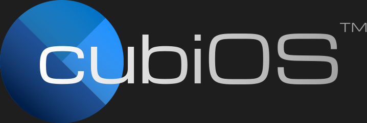

<div align="center">




![lowlevel](https://img.shields.io/badge/lowlevel?style=for-the-badge&logo=data%3Aimage%2Fpng%3Bbase64%2CiVBORw0KGgoAAAANSUhEUgAAAIAAAACACAYAAADDPmHLAAAKD0lEQVR4Xu1dd8xeUxhv0VglNLaiNYuqELMImhitFaNiqwhixx4x2hB7xIoR4Q9ClCJW7UqNmomEqlmt1g5ix%2Fb7pe%2FL%2Fb7vvve959znee45vedJTnr7vefZv3vuOuc5%2FfslanQE%2Bjfa%2B%2BR8vwSAhoMgASABoOERaLj7aQRIAGh4BBrufmwjwCjk6xK0TdH%2BQXsM7Vi02TXlcTXovQFtDBpj%2BRraGWhTarLHWW0MAFgQXj2KtlOBd3%2FhtyXQfnWOgB%2FDomD7CW2BAvbJ%2BG03NNoWLIUMgFURteloAx2itzL6fubQ36crdcx1YPwBfUeg1TVKFZoaIgDWhMUz0BZyCHK2K0eMvz15u7HxjPc9o%2F8A7zC0md2UWP4eEgA4hH%2BOtrhAAJgo3iNIEmMlAawfIWcFtF8kjfOVFQoAXoQDI32d6MA3CH%2F%2FTkjm0pDzrZCstphpCj47m1g3AHaFxQ87W12e4WJ0Pbt899yelHFmRRlF7KPx4%2BOK8gtF1wkADvccCi3oQCi5y1HRWPSf6Mjj230OGHnTa051AGBDePmmuafzFL6FdhYaHyvzaBf8ke8Zhtdk3zrQ%2B76lbmsA3A7nxlk6GKGuW2DzUVZ2WwKAw9xgK8ci18N3GXzfoE5WAJgET%2FZS92b%2BUsBHTr7TUCULAEg9P6sGIlDhn2qPmhYAuA1OHBZogGMwayUYyScmFbIAgPQbOZVABCyUT0wbadmXAKAVWVm5anlSE5zxP40A1cGglic1wRmfP8Axv%2FAl8o%2BAWp7UBGd83RLHL%2Fn73njOWYjAUK0oWACAtqfLgH8GtwDrK%2F7sxZxWAPgGZvDzbCL3CKjmSFV4xtfxOD7f3ffGc6i%2FDbQCwCZIJWfMJnKLwIPovqcbi1tvKwAsArOsZuy6RSDs3ifDvKs1TbQCQLoR9MvifmC7x4%2B1HJcVAJaBOV%2BXMyn1ykTgEBzfoRkRKwBoz%2F3TjFGdsi%2BE8nM1DbACAOfj7a%2FpyHwq%2B1X4tbmmb1YASC%2BC%2FLOomiNV4RmfEwAaDICr4PtJ%2Fv43nvMURIAxVCGLESCd%2FdVTp5YnNcEtn%2FkIc1B1%2FxsvYV9E4F6NKGgCYFkY%2FJWG0Q2VqZIrFaGtBKWhXxapKmsFtACQki%2Bb%2FLa0B3Agur5CGgBc48%2BKGIn0IsDV1LtLiZcEABdVskBSqMTKHpej3Yr2UQcjWfSJ6%2FJORRsQqiOw60s0kZXVEgA4EsbcHHCwToBt13naxwpk13vyWrAd0QK0ty4fAHCYPxSNM3z4lS9U2huG3S9kXOgfs7wLYZQFwBMI5I5CwdQW8zIUcCayBr0AoVtpCBaUyacFLsM%2FD61rTaNuANgGQqYKGqctinX5HlFWwiIS2jqkXPgYglYvElYEgI3B%2BIaUJQZyeAP3iYEeqljFUJeESx3zXASAmJ7lWV%2BHBSgsicUurHX6%2BvcnGHOfajoBYDwYYpnGbTHsdwp8TJeD3O8JnQAQy9nP%2BoJb%2B54WQnzPB2BDGVeY0z61jWMHQLeb2DKBkegTywnTJ14xA0DyOb8qCHgZeqiqEAP%2BUgDYDIaoLUYUdDKUs7%2FtUgyjQJ%2BFpnlBZFlUvlkKmU6EcdcGZmDor40ZLt7cT8jGLQ8ArFtbtDlDCHEP7eyPZRR4Gobu0A0A3AlDomS7FlD4Vc93LwEtm9pyuSdAqLbRRq7PXKwbAEK%2Fll0GB0L97KxdWVwCwD1Gz7yhNHQADEEUZktEQkEGbeP795ApegCEev2P5T4gAUD59Ax9BE0ASAD4PwIx3gOkS0A1BKcRoFr8unKnS0DXEFXrkEYAwfjFeAlg2dlO07qrhaY691oQYbrnj4fJ0V8CroTTnLcfIl0Ko04P0bCWTX3eouaNANzRkpsjh0odpzcFYDADXLShdN0mvg4DuPP6f5QHgBhmuIR6HxD6DeAVyPxp3QBwETpwb72QSb2AoofzrIKiVsnDw548Fi5w6bFnYt6ZFMtagNBGgdDPfgKiz87qMU8J4zJpLpcOgfaBESoVPISdKzUljDpjQDPtDGUUiDZenQIYS20fzl3kPLc6iTZwHmXodDcMPKC3kUVnUCyoZjl1llWvg%2FaoUberv7m5LgJATCXehyIas1wjUrE%2F1yJa6%2FQ1%2BWAw3pnHXOYaOheMJhsZ%2B3rX4rMEQUzJPx7x6VjkogwA2nnhVGwOt3xMDPVtl8XlIJZFIFwpvTbab0UnlgsAesvhzGE%2B%2BoyueOZKs2veGHL7O63iE1Xj8BwE8FsEp%2FWXpioAyCph4aXDS2u16Sg5GoyFyRNtzHbSwin8w9G8J8lKAYBWL4zGeeeSMp2i0aFzlWLLLDB1jYQRCjLWg8wZVeVqJCvUm0Z%2BReRyshvRPuwQON5IHoPGbw2h3ucwvqxQIkIaAKBhLFS0ooiFSUg2AtPwn5GSIdECAG1khSpN%2BZJxiEEWRy3OOBIlzQRxUgknlySSiYBKrlSEZvxNm0XJJH95iFEpva8NALofyzcFmVTJS1EZ%2BttmWgAg5Jcn8umSl8jH69%2Flxc6TaAGA5aCH1a0T%2BUVANUeqwjP%2BpsuAX%2FLnm51DEwD8AMDvLapPUlYjwHQ4wleXidwioJ4fdQUtfzljh7NnErlFQD0%2F6gpa%2Ft6Hf1nYMZFbBNTzo66g5S93we6xJMktDo3trZ4fdQWt1IW%2BZi5UhKnnR11BK7LpKcAPYur5UVcAv%2FldnSNAIvcISM5qytVuAQBu2Xacu%2B%2BJAxEQnfyRF1ELAKThvxqWVXOkKhx%2BD0OrPG%2BtWvyi5%2Bb7E7W9CLQBEMsaw5BRwj0bd9YyUBsAb8Pw9bWMb4jcqOcDPIskbd%2BQRGm5yYUeaotvtEeAcTCe25gm8o8At4rnlvEqpA0AGp2eAqqlTjVHqsJbfk%2FCvyznksg9AhPAMt6drTyHBQBozc9oPbYqKW9iY3uyGiqroqqSFQDoBO9m11D1Zv4Rzud%2Bk%2FkTlgBgerjfT49ChTXkjHXyOKyyamZvYhk1rnLmMuularCNKlVf%2FPT2yRoA1D8EzXpfHe7mNQLtXcekWtb%2B5c0yy%2FKoTQHP870OALTtmImDoY4J8ek%2BBkyTfRgzPNqVwHijzFqD5lQnAOjsdmhTlLyW3l%2BQm2k6Vd8o6RfrL3E1dS1UNwDaTj%2BDg1GCEeBTx0BBeW1Rg3EwR0hun8LNQnKdxIQCABrN1cRfoC3p5EF%2BZ02%2F1oXKdyrYyO8jG1TgF2XVDJSvoXxU5CfkAZ4CVNfStWw6B%2F9e4Ggfwc3ycqY3ed1sDBEAbZsZLJ4tLkP5tug%2FtZvTQr%2BzNDxLxHej99CBTyBBJb5tdMgAaNvIzZifROv2VZGAYW08SxoEZXxjl%2FfO4Cb8%2FWhLY3x0xQCArF8s0siXSZxpROKlggUsn%2FJxXpiHseT9y%2FfCclXFxQYA1WA0UXgCQBOznvE5ASABoOERaLj7aQRIAGh4BBrufhoBGg6AfwED6EOQIjqEgQAAAABJRU5ErkJggg%3D%3D&logoColor=%23ffffff&color=%23919191)


**A minimal operating system kernel built from scratch**

[Features](#features) • [Quick Start](#quick-start) • [Requirements](#requirements) • [Installation](#installation)

---

</div>

## ✨ Features

- **Low-level system programming** — Direct hardware interaction via assembly and C
- **Custom bootloader** — Built with NASM for x86 architecture

## 🚀 Quick Start
```bash
# Build the kernel
make

# Run in QEMU
make run

# Clean build artifacts
make clean
```

## 📦 Requirements

Ensure these tools are installed before building:

| Tool | Purpose |
|------|---------|
| **🪐 nasm** | Assembler for boot sector and kernel code |
| **💽 i686-linux-musl-gcc** | Cross-compiler targeting 32-bit x86 |
| **🔗 i686-linux-musl-ld** | Linker for creating kernel binary |

> **Note:** The cross-compiler and linker may be replaced with alternatives depending on your toolchain (for example, to i386 toolchain).

## 📩 Installation

### Installing NASM

**Arch Linux:**
```bash
sudo pacman -S nasm
```

**Ubuntu:*** 
```bash
sudo apt install nasm
```

### Installing Toolchain

1. Download the cross-compiler:
```bash
wget https://musl.cc/i686-linux-musl-cross.tgz
tar xf i686-linux-musl-cross.tgz
```

2. Add to PATH:

**ZSH:**
```bash
echo 'export PATH="$HOME/i686-linux-musl-cross/bin:$PATH"' >> ~/.zshrc
source ~/.zshrc
```

**BASH:***
```bash
echo 'export PATH="$HOME/i686-linux-musl-cross/bin:$PATH"' >> ~/.bashrc
source ~/.bashrc
```

### Verify Installation
```bash
# Check NASM
nasm -v

# Check cross-compiler
i686-linux-musl-gcc --version

# Check linker
i686-linux-musl-ld --version
```

### Using in VirtualBox
```bash
VBoxManage convertfromraw os.img os.vdi --format VDI
```
Then create a new VM in VirtualBox and attach `os.vdi` as a virtual hard disk. ( Settings > Storage > Add Hard Disk, select `os.vdi`, delete the existing virtual disk if any. )
### ⚠️ Important

**\*** — Untested software/commands

> This project was developed and tested on EndeavourOS (Arch Linux) with zsh shell.

---

<div align="center">
Made with curiosity
</div>
